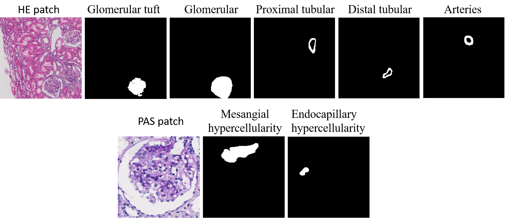

## Introduction

Kidney pathology annotation dataset, including HE and PAS stained patch image. 

## Detail

The file contains two folders, HE and PAS. The original image file name ends with ‘00.png’. The annotated image ends with 'Category index_number.png'.

Table1.Correspondence table of category index and kidney structure

|  Category index  |        1        |     2      |        3         |       4        |    5     |     7     |      8      |
| :--------------: | :-------------: | :--------: | :--------------: | :------------: | :------: | :-------: | :---------: |
| Kidney structure | Capillary lumen | Glomerular | Proximal tubular | Distal tubular | Arteries | Mesangial | Endothelium |

